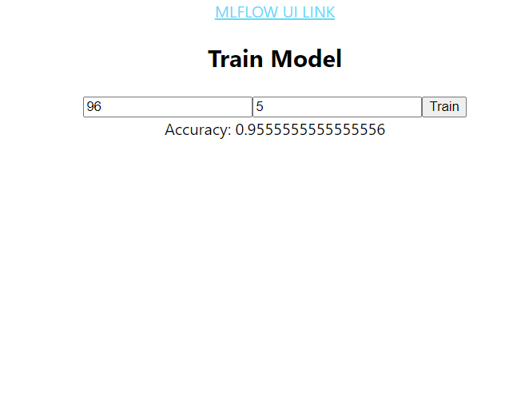

# Run docker build from root directory

docker-compose up --build

# Test Rest API
curl -d '{"n_estimators":100, "max_depth":4}' -H "Content-Type: application/json" -X POST http://localhost:8000/train

curl -d '{"n_estimators":100, "max_depth":4}' -H "Content-Type: application/json" -X POST http://backend:8000/train

Flask API 
http://localhost:8000/train
http://localhost:8000/health

React UI
http://localhost:3000

MLFLOW UI
http://localhost:5000

